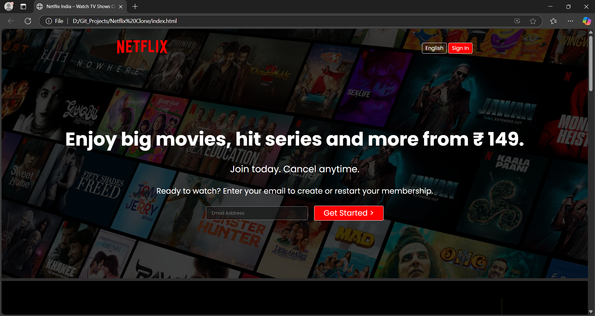
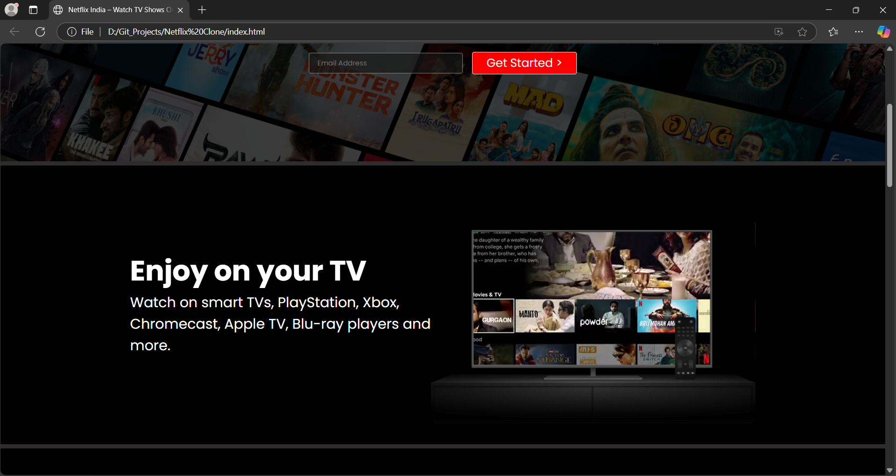
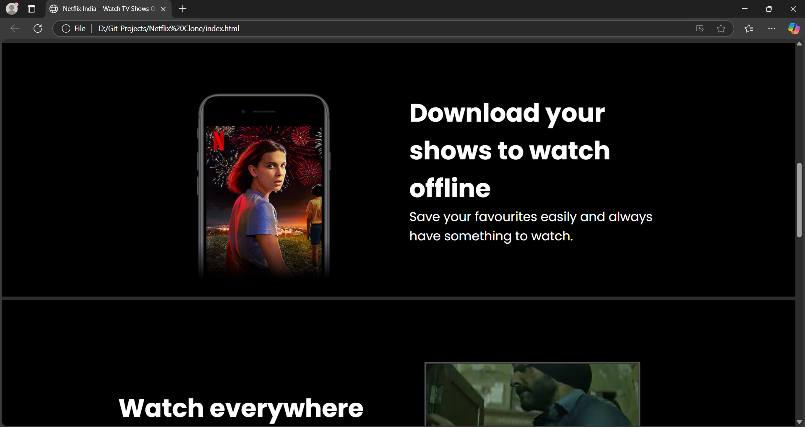
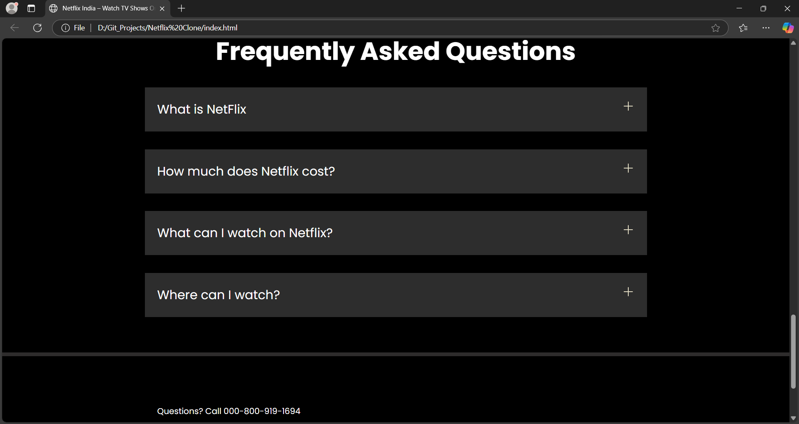

# 🎬 Netflix Clone

This is a front-end **Netflix Clone** created using **HTML and CSS**, designed to replicate the homepage of Netflix with a clean, responsive layout and rich visual styling.

> ✅ Fully front-end based  
> ✅ No frameworks or external libraries used  
> ✅ Ideal for learning layout techniques, responsiveness, and custom styling

---

## 📸 Preview

---

## 🚀 Features

- ✅ Hero banner with promotional content
- ✅ Responsive TV preview section with embedded video inside TV frame
- ✅ Custom language dropdown with styled arrow
- ✅ FAQ section with expandable answers
- ✅ Clean footer with useful links

---

## 🛠️ Technologies Used

- HTML5
- CSS3 (Flexbox, Grid, Media Queries)

---

## 📁 Folder Structure

netflix-clone/ ├── images/ │ └── (all project images like tv.png, logo.svg etc.) ├── videos/ │ └── (video file used inside the TV preview) ├── index.html ├── style.css └── README.md

---

## 💡 How to Run

1. **Clone or Download** this repository.
2. Open `index.html` in your browser.
3. That's it — no build tools, no setup. Just pure HTML/CSS.

---

## 📱 Responsive Design

This Netflix clone is fully responsive and adapts beautifully to:

- 🖥️ Desktop screens
- 📱 Mobile phones
- 📱 Tablets

---

## 🙏 Acknowledgements

This project is inspired by Netflix UI, built for educational and non-commercial purposes.

---

## 📄 License

This project is open-source and free to use under the **MIT License**.

---

## 🌟 Show Some Love

If you find this useful, give it a ⭐ on GitHub or share it with your friends!
